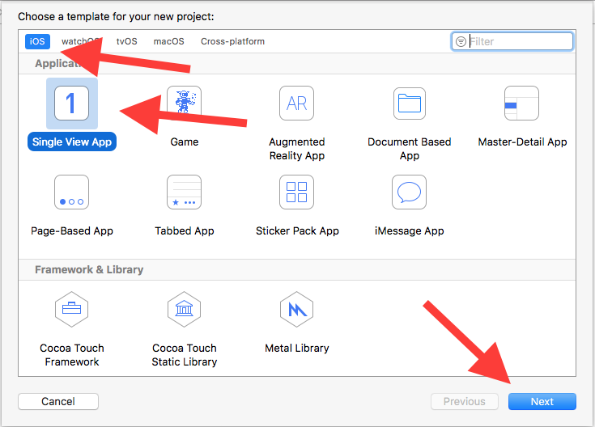
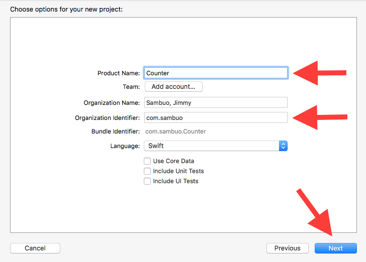

# Lesson 1: New Project

Xcode is the tool we use to create iOS apps.

### Steps
1. Download [Xcode](https://developer.apple.com/xcode/). You will need a Mac for this.
2. Launch Xcode. Select `Create a new Xcode project`

3. Make sure `iOS` and `Single View App` is selected and click `Next`

4. Give your App a name and Identifier.

5. Press the Play button on the top left corner (Or go to Product > Run)

6. The simulator should start with an white screen.

Congratulations, you have just launched your first iOS app!
