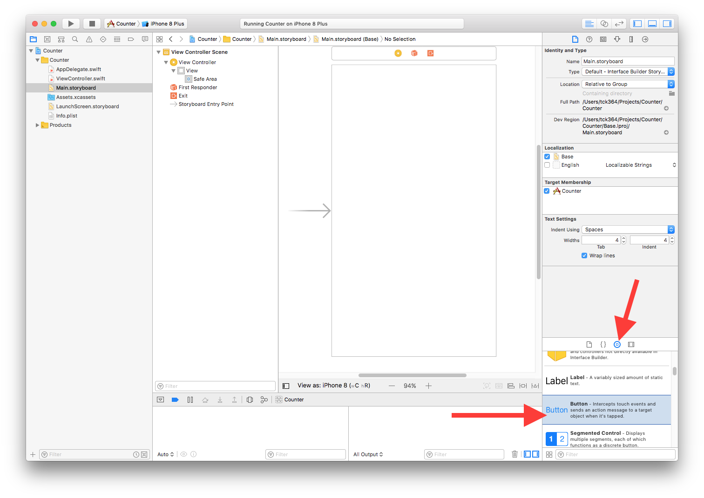
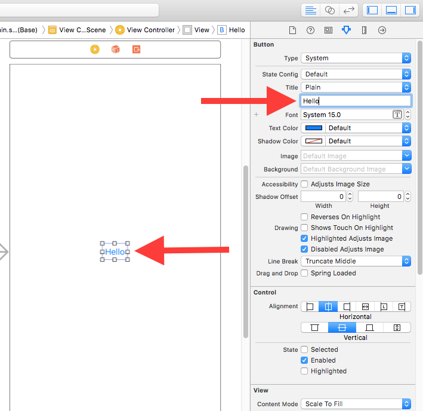

# Lesson 2: UI Elements

Add UI elements to your app to make it look nice.

### Steps
1. Select `Main.storyboard` in your Project Explorer.

2. In the Object Library, search for Button. Drag and drop it into the View Controller.

3. In the Attributes Inspector, change the title to "Hello".
4. Press Enter. Notice the text changes in Interface Builder. 

5. Build the app. Notice the button is there.

6. Try changing other properties such as Color or Font. Build the app and see it change.
7. Try adding other object, such as a Label, Slider, Switch, Text Field, and Segmented Control.

When you are ready, let's move on to [Lesson 3](Lesson_3/README.md).