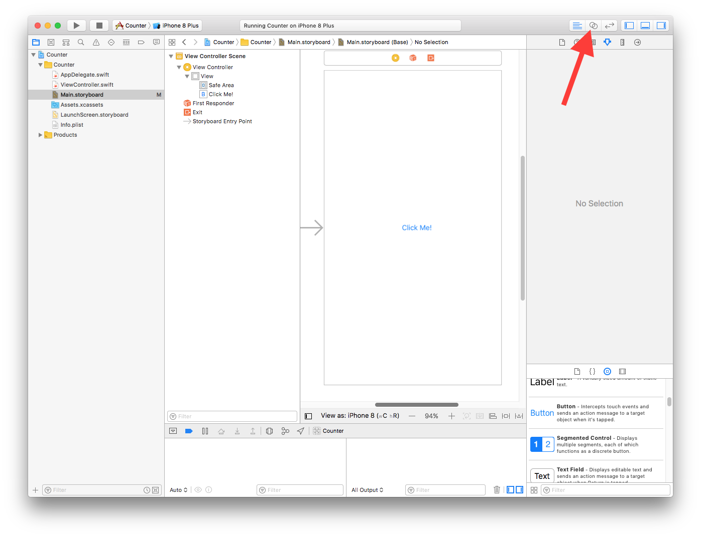
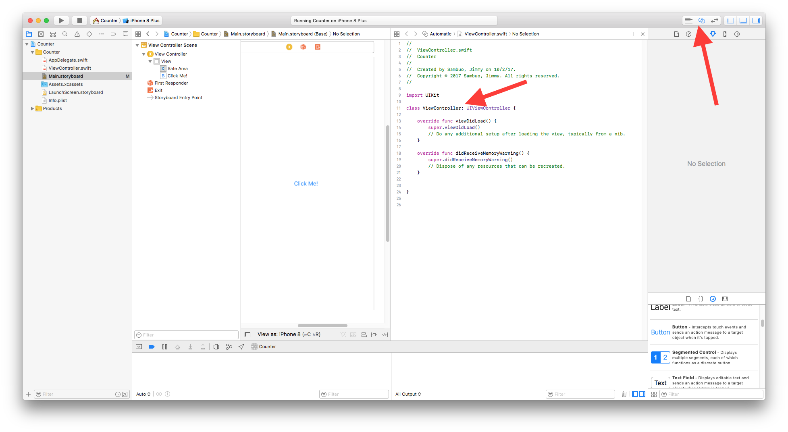
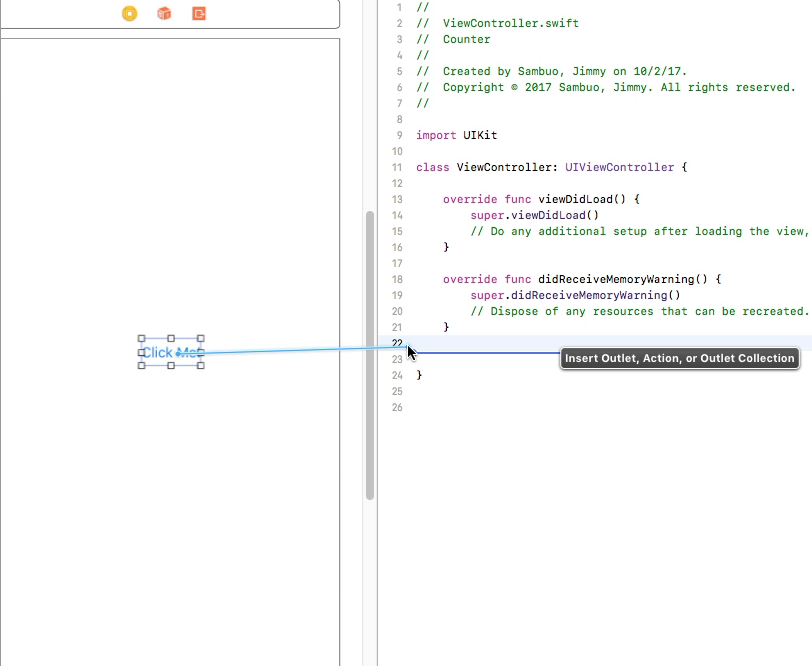
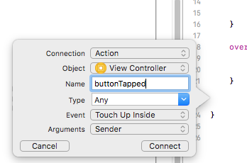
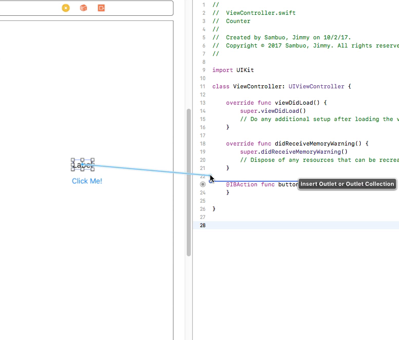
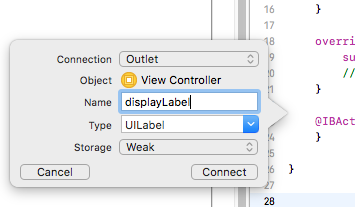
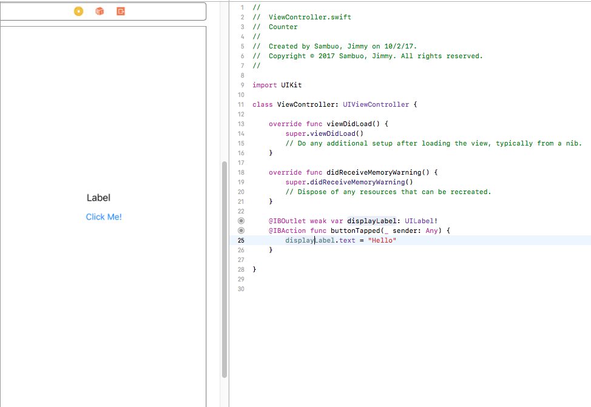

# Lesson 3: Adding Logic

Logic is the magic that allows your app to work.

### Steps
1. Start with a button on your View Controller.

2. Click 'Show the Assistant Editor'. You should now see Interface Builder, as well as the code controlling the View Controller.

3. Right click (or two finger click) on the button, and drag it to the code, just below `didRecieveMemoryWarning()`.

4. Change Connection to `Action` and give it the name of `buttonTapped`.

5. Add a Label.
6. Right click and drag it to the code above `buttonTapped`.

7. Give it the name `displayLabel`.

8. Inside the function `buttonTapped`, type this line of code: `displayLabel.text = "Hello"`. This will change the label's text to Hello when you tap the button.

9. Run the simulator. Tap the button and the label's text should change.

Now you know how to run code when the button is tapped. To learn about variables, move on to [Lesson 4](/Lesson_4/README.md).
