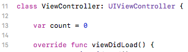
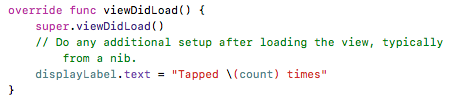
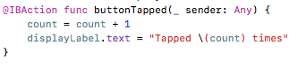
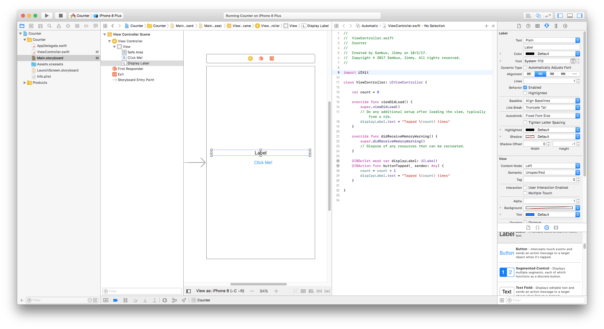
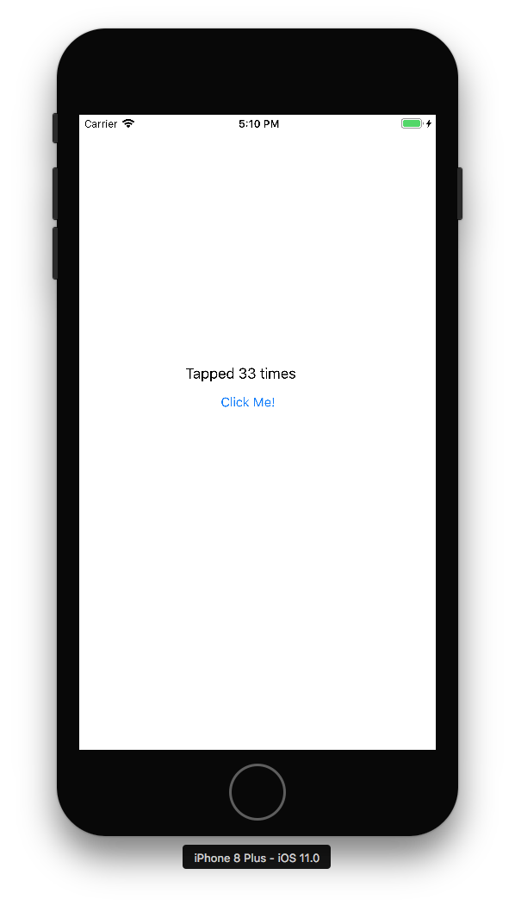

# Lesson 4: Variables

Variables are containers that allow you to store, retrieve, and update data.

### Steps
1. Start with the code from Lesson 3.
2. Add a property called `count` and set the default to 0.

3. In `viewDidLoad`, set the displayLabel's text to "Tapped \(count) times"

4. In `buttonTapped`, increment count by one, and update the display label's text.

5. Your code should look like this.

6. Run your app in the Simulator and tap the button a few times. It should count how many taps you made.

